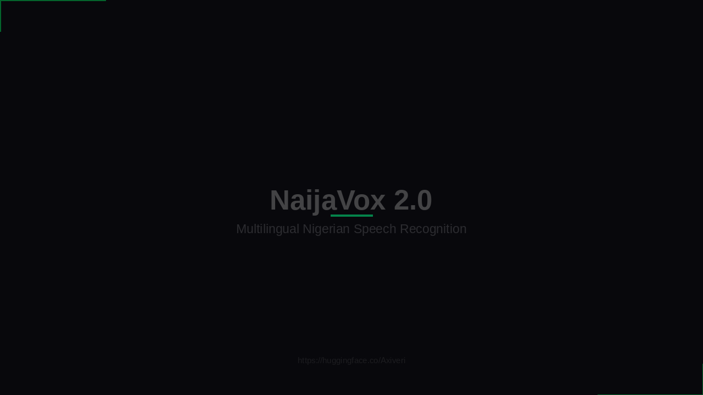

<div align="center">

<h1>EmemediaForge</h1>

**Turn any Speech AI model into a polished showcase video — with one command.**

[](https://github.com/Ememzyvisuals/ememediaforge/actions)
[](https://github.com/Ememzyvisuals/ememediaforge)
[](LICENSE)
[](https://github.com/Ememzyvisuals)
[](https://huggingface.co/Axiveri)

*An open source contribution to the global AI community by [Emmanuel Ariyo (@Ememzyvisuals)](https://github.com/Ememzyvisuals), Axiveri.*

</div>

---

## What Is EmemediaForge?

EmemediaForge is a **CPU-only, open source Python CLI tool** that converts raw audio samples and transcripts into professional MP4 showcase videos for Speech AI models.

No GPU. No cloud. No design skills. Just a YAML file and your audio.

```bash
forge build project.yaml
```

```
dist/
├── demo.mp4        ← ready to upload anywhere
├── thumbnail.png   ← cover image
└── metadata.json   ← build info
```

---

## Who Is It For?

EmemediaForge is built for anyone working in the speech AI space:

- **ML researchers** releasing TTS or ASR models on HuggingFace
- **AI startups** demoing voice products to investors or users
- **Indie developers** building speech tools and sharing them publicly
- **African AI builders** working on low-resource language models (Yoruba, Hausa, Igbo, Pidgin, Swahili, Amharic, etc.)
- **NLP educators** creating course material or tutorial content
- **Open source contributors** who want their model releases to look as good as they perform

---

## Use Cases

### 🎙️ TTS Model Showcase
Display your text-to-speech model converting written text into speech — words highlight karaoke-style in perfect sync with the generated audio. Ideal for HuggingFace model cards, GitHub READMEs, and social media announcements.

### 🎧 ASR / STT Model Showcase
Show your speech recognition model transcribing audio in real time — the predicted transcript is revealed word by word as the audio plays. Powerful for demonstrating accuracy on low-resource or under-represented languages.

### 🌍 Low-Resource Language Documentation
Record audio in any language — Yoruba, Hausa, Igbo, Nigerian Pidgin, Swahili, Twi, Amharic, Kinyarwanda — and generate a video that demonstrates the language with synchronized subtitles. A tool for linguists, language preservationists, and African AI labs.

### 📊 Research Paper Demos
Attach a polished video demo to your arXiv paper, ACL/EMNLP/INTERSPEECH submission, or conference poster. Reviewers and readers respond to seeing a model work, not just reading about it.

### 🏢 AI Startup Product Demo
Use EmemediaForge to build demo videos for investor decks, product landing pages, or sales calls — without a video production budget. Ship a new demo every sprint.

### 🎓 Educational Content
Create explainer videos showing how different voices, accents, or languages sound through a TTS system. Perfect for AI/ML course material, YouTube tutorials, or workshop slides.

### 📣 Social Media & Content Creation
Generate short-form demo videos (1080×1920 for Reels/TikTok, 1080×1080 for Twitter/X, 1280×720 for YouTube/LinkedIn) from the same config file — just change the `resolution` field.

### 📦 Dataset Announcements
Releasing a speech dataset? Generate a video that plays audio samples with their transcripts displayed — gives your dataset a human face before anyone downloads it.

### 🔬 Model Comparison
Run EmemediaForge twice with two different models on the same audio. Stack the outputs in any video editor for a side-by-side quality comparison.

---

## Features

- **Karaoke word sync** — words highlight in real time as audio plays (energy-based, no Whisper needed)
- **Animated waveform** — music-visualizer style bars driven by live audio amplitude
- **Four themes** — `modern`, `light`, `dark`, `minimal`
- **Two templates** — `tts` (text-to-speech) and `stt` (speech-to-text / ASR)
- **Three resolutions** — `1280×720` (YouTube/LinkedIn), `1080×1080` (Twitter/Instagram), `1080×1920` (TikTok/Reels)
- **Multiple samples** — showcase as many voices or clips as needed in one video
- **Intro + outro scenes** — branded fade-in/fade-out with logo, title, URL
- **Thumbnail export** — high-res PNG of the intro scene
- **Metadata JSON** — structured build info for CI/CD pipelines
- **Zero GPU required** — runs on laptops, GitHub Actions free tier, Kaggle, Colab
- **Language agnostic** — works for any language, including tonal and low-resource languages
- **Optional high-accuracy alignment** — install `stable-ts` extra for Whisper-powered word timing

## Example Output

> **NaijaVox 2.0** — generated automatically on every release by `forge build demo/project.yaml`
> using the `dark` theme · `stt` template · `1280×720`

[](https://github.com/Ememzyvisuals/ememediaforge/releases/latest)

*Click the image to go to the latest release — `demo.mp4` and `thumbnail.png` are attached as release assets.*

| Setting | Value |
|---------|-------|
| Theme | `dark` |
| Template | `stt` (Speech-to-Text) |
| Resolution | `1280×720` |
| Samples | Yoruba · Nigerian Pidgin |
| Alignment | Energy-based (no GPU) |

The demo video and thumbnail above are built fresh on every release by the CI pipeline —
no manual recording or editing involved.

---

---

## Install

**Requires [FFmpeg](https://ffmpeg.org/download.html) installed on your system.**

```bash
# macOS
brew install ffmpeg

# Ubuntu / Debian / Colab / Kaggle
sudo apt install ffmpeg -y

# Windows — download from https://ffmpeg.org/download.html and add to PATH
```

**Install EmemediaForge:**

```bash
git clone https://github.com/Ememzyvisuals/ememediaforge.git
cd ememediaforge
pip install .
```

**Or install directly from a release (no git required):**
```bash
pip install https://github.com/Ememzyvisuals/ememediaforge/releases/download/v1.0.0/ememediaforge-1.0.0-py3-none-any.whl
```

**Or pin to a specific version:**
```bash
pip install git+https://github.com/Ememzyvisuals/ememediaforge.git@v1.0.0
```

---

## Quick Start

```bash
# Scaffold a new project
forge init my-model-demo
cd my-model-demo
```

Drop your audio and transcript files into `samples/`, then edit `project.yaml`:

```yaml
project:
  name: NaijaVox 2.0
  description: Multilingual Nigerian Speech Recognition
  author: Axiveri
  url: https://huggingface.co/Axiveri/NaijaVox-2.0

theme: dark
template: stt
logo: logo.png
resolution: 1280x720
fps: 30

samples:
  - title: Yoruba Sample
    audio: samples/yoruba.wav
    transcript: samples/yoruba.txt
    language: yo

  - title: Nigerian Pidgin
    audio: samples/pidgin.wav
    transcript: samples/pidgin.txt
    language: pcm
```

Validate your config first:
```bash
forge validate project.yaml
```

Then build:
```bash
forge build project.yaml
```

---

## Commands

| Command | Description |
|---------|-------------|
| `forge init [dir]` | Scaffold a new project with example config and folder structure |
| `forge validate <config>` | Check config + verify all asset files exist — no build triggered |
| `forge build <config>` | Full render: audio analysis → alignment → frames → FFmpeg → MP4 |
| `forge build <config> --fast` | Same, but uses FFmpeg `ultrafast` preset — 5–10× faster encode, slightly larger file. **Recommended for CI, Kaggle, Colab, and quick previews** |
| `forge build <config> --stable-ts` | Uses Whisper-tiny for higher-accuracy word alignment |
| `forge build <config> --output ./out` | Override output directory |
| `forge build <config> --fast --output ./out` | Fast mode + custom output (combine any flags) |
| `forge version` | Print installed version |

---

## Themes

Set with `theme:` in `project.yaml`.

### `dark` — Near-black · Neon green accent
```
bg #08080C   accent #00FF88   text #FFFFFF
```
Best for: AI model launches, X/Twitter posts, high-impact social content.

### `light` — Pure white · Electric blue accent
```
bg #FFFFFF   surface #F0F4FF   accent #2563EB   text #0F172A
```
Best for: HuggingFace model cards, academic demos, LinkedIn posts, clean screenshots.

### `modern` — White · Deep purple accent
```
bg #FFFFFF   accent #7C3AED   text #111827
```
Best for: Professional demos, product pages, conference talks.

### `minimal` — Off-white · Pure black accent
```
bg #FAFAFA   accent #000000   text #000000
```
Best for: Research papers, academic presentations, print-adjacent content.

---

## Templates

### `tts` — Text-to-Speech
Words from the transcript are highlighted one by one as the model speaks them. The transcript is what the model received as input text.

### `stt` — Speech-to-Text / ASR
The predicted transcript is revealed progressively as the audio plays. The transcript is what the model output from the audio.

---

## Configuration Reference

```yaml
project:
  name:        "Model Name"          # displayed as the headline
  description: "Short description"   # subtitle in intro/outro
  author:      "Author or Org"       # footer attribution
  url:         "https://..."         # HuggingFace or GitHub URL

theme:      dark          # dark | light | modern | minimal
template:   tts           # tts | stt
logo:       logo.png      # optional PNG logo (transparent background recommended)
resolution: 1280x720      # 1280x720 | 1080x1080 | 1080x1920
fps:        30            # 24 | 25 | 30 | 50 | 60

samples:
  - title:      "Voice Label"         # shown on screen
    audio:      samples/audio.wav     # .wav .mp3 .flac .ogg .m4a .aac
    transcript: samples/text.txt      # plain UTF-8 text file
    language:   en                    # BCP-47 code: en yo ha ig pcm sw am …
```

---

## Supported Audio Formats

| Format | Extension |
|--------|-----------|
| WAV *(recommended)* | `.wav` |
| MP3 | `.mp3` |
| FLAC | `.flac` |
| OGG | `.ogg` |
| M4A | `.m4a` |
| AAC | `.aac` |

WAV is recommended for cleanest waveform analysis and fastest processing.

---

## Word Alignment

EmemediaForge ships a **zero-dependency energy-based aligner** — no model download, no GPU, no internet, works offline. It analyzes audio amplitude to detect voiced segments and distributes transcript words proportionally.

This approach is language-agnostic and works reliably for tonal and low-resource languages where standard ML aligners (MFA, Whisper) often fail.

**For higher-accuracy alignment** (English, code-switching, fast speech):
```bash
pip install "ememediaforge[stable_ts]"
forge build project.yaml --stable-ts
```

This downloads a ~150MB Whisper tiny model on first use. CPU-compatible.

See [`docs/ALIGNMENT.md`](docs/ALIGNMENT.md) for full details.

---

## Kaggle / Colab

```python
!apt install ffmpeg -y -q
!pip install git+https://github.com/Ememzyvisuals/ememediaforge.git -q
!forge build project.yaml
```

---

## Performance

All rendering runs on CPU. No GPU required.

| Video Length | Samples | Approx. Render Time |
|-------------|---------|---------------------|
| ~10s | 2 | 30–60 seconds |
| ~30s | 4 | 2–3 minutes |
| ~60s | 6 | 5–8 minutes |

Render time scales with video duration × resolution. `1280×720` renders roughly 2× faster than `1080×1080`.

---

## Tips & Recommendations

### Get the best karaoke sync
- **Match the transcript exactly** to what is spoken — every word, no extras
- **Use WAV format** for cleanest audio analysis; MP3 compression artifacts confuse the energy detector
- **Normalize audio** to around −3 dBFS before building — consistent amplitude gives better waveform animation
- **Avoid background music** in your samples — it raises the noise floor and throws off voiced segment detection
- **Keep samples under 30 seconds each** — long samples make for very large videos and slow CI builds
- Add `--stable-ts` if you have fast speech, lots of short words, or heavy code-switching between languages

### Speed up your build
- Use `--fast` during development and in CI — it uses FFmpeg's `ultrafast` preset and is 5–10× faster with almost no visible quality difference at web resolutions
- Use `resolution: 854x480` in your config during iteration, switch to `1280x720` for the final release build
- Reduce `fps: 24` for faster renders — human eye can't tell the difference from 30fps for speech demos
- Keep your sample count low (2–3 samples) for the demo video; link to more samples in your model card

### Running on Kaggle / Colab
```bash
!apt install ffmpeg -y -q
!pip install git+https://github.com/Ememzyvisuals/ememediaforge.git -q

# Always use --fast on Colab/Kaggle — CPU is shared, rendering is slower
!forge build project.yaml --fast
```

### Social media formats at a glance
| Platform | Resolution | Flag |
|----------|-----------|------|
| YouTube / LinkedIn | `1280x720` | default |
| Twitter / X (square) | `1080x1080` | `resolution: 1080x1080` |
| TikTok / Reels / Shorts | `1080x1920` | `resolution: 1080x1920` |

Generate all three from the same audio — just change `resolution:` and run again.

### Choosing a theme
- `dark` — highest visual impact, best for X/Twitter and tech audiences. Use for NaijaVox, Africlaude, and AI model launches
- `light` — matches HuggingFace's white UI. Best for embedding directly in model cards
- `modern` — professional purple, good for LinkedIn and product demos
- `minimal` — clean black-on-white for academic papers and conservative audiences

### Logo tips
- Use a **PNG with transparent background** — renders cleanly over any theme color
- Recommended size: at least **200×200px** before scaling (the tool resizes automatically)
- If you don't have a logo yet, remove the `logo:` line from your config — the layout adjusts automatically

---

## Troubleshooting

### Build hangs and never completes
This was a known bug in early versions caused by a deadlock in the FFmpeg stderr pipe. It is fixed as of v1.0.0. If you are on an older version, update:
```bash
git pull origin main && pip install -e .
```
If it still hangs, add `--fast` — ultrafast encoding is less likely to buffer-stall under memory pressure:
```bash
forge build project.yaml --fast
```

### `FFmpeg not found in PATH`
Install FFmpeg for your platform:
```bash
# Ubuntu / Debian / Colab / Kaggle
sudo apt install ffmpeg -y

# macOS
brew install ffmpeg

# Windows — download from https://ffmpeg.org/download.html
# Then add the bin/ folder to your system PATH
```

### `Config file not found` / `Asset not found`
Run `forge validate project.yaml` — it tells you exactly which files are missing and where it looked.

### Words are out of sync with the audio
- Check the transcript matches the audio exactly (no missing or extra words)
- Try `--stable-ts` for better alignment (requires `pip install "ememediaforge[stable_ts]"`)
- Make sure your audio has minimal background noise or music

### Output video has no audio
- Confirm your audio file path in `project.yaml` is correct
- Run `forge validate project.yaml` to check
- Ensure FFmpeg has AAC codec support: `ffmpeg -codecs | grep aac`

### Font looks pixelated or ugly
Run `forge init` — this downloads the Inter grotesk font to `~/.ememediaforge/fonts/`. If you already ran init, check that the download succeeded:
```bash
ls ~/.ememediaforge/fonts/
```
If the folder is empty or missing, the tool falls back to the bundled Liberation Sans, which is also a clean grotesk font. Quality will still be good.

### Rendering is very slow
- Add `--fast` to your command
- Drop resolution to `854x480` for quick previews
- On Colab/Kaggle, shared CPU can be slow — `--fast` and lower resolution helps significantly
- For long audio (>60s per sample), consider splitting into shorter clips

---

---

## Development Setup

```bash
git clone https://github.com/Ememzyvisuals/ememediaforge.git
cd ememediaforge
pip install -e ".[dev]"

# Run tests
pytest tests/ -v

# Lint
ruff check ememediaforge/
```

---

## Contributing

Contributions are welcome. See [CONTRIBUTING.md](CONTRIBUTING.md) for guidelines.

Areas where contributions are especially valued:
- New themes
- New templates (e.g. model comparison, evaluation display)
- Better alignment for specific language families
- Windows testing and bug reports
- Documentation improvements

---

## Roadmap

- [ ] v1.1 — Custom theme via `project.yaml`
- [ ] v1.1 — SRT subtitle file export
- [ ] v1.1 — Audio normalization pass before render
- [ ] v1.2 — Side-by-side model comparison template
- [ ] v1.2 — WebM export option
- [ ] v2.0 — GPU-accelerated rendering

See [CHANGELOG.md](CHANGELOG.md) for release history.

---

## License

[MIT](LICENSE) © 2026 Emmanuel Ariyo ([@Ememzyvisuals](https://github.com/Ememzyvisuals)), Axiveri.

---

<div align="center">

Built with purpose for the African AI ecosystem and the global speech AI community.

**[@Ememzyvisuals](https://github.com/Ememzyvisuals)** · **[Axiveri](https://huggingface.co/Axiveri)** · **[NaijaVox](https://huggingface.co/Axiveri)** · **[Africlaude](https://huggingface.co/Axiveri)**

</div>
